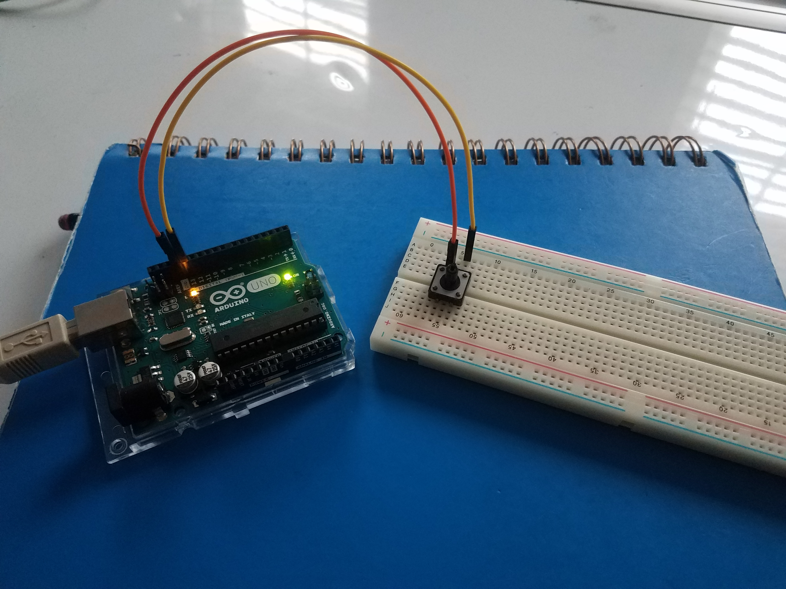

# Exploring Electronics - Gurpreet R.
<!--
Welcome to your project page for Electronics for the Rest of Us. You'll use this page to describe and showcase your work throughout the module. 
A place for each deliverable has been created below for you in this markdown document. 
Note that comments (such as this) will not appear in the final markdown document (which you can view with the "Preview" button).
-->


## Day 1: Reflection

After completing the first day of this module and getting a chance to go through the varies exercises, I am excited to see what I can learn through the week. I did not have much expectations for this module, so after seeing the kit and learning about the assignments, it seems interesting. I had chosen this module because the name was intriguing. To learn more when it comes to electronics, I thought it would be good to get some skills and learn some new tools that could be beneficial in the future. Also I am more of a kinesthetic learner, so it was nice to know it’s more of a hands on course. Especially during the pandemic, it is not enjoyable to just be sitting on the computer listening to lectures and do readings, so that was also an factor. I have learned about coding in one of my courses before and I really loved it, so when I saw there was coding in this, it was another reason to chose it. I hope to learn more about coding and get familiar with circuits. As well, be able to create small inventions of my own. Also, the skills that could be learned with the programs/software’s, seem to be ones that would be useful in the future, since everything is become more digital. Hoping to have fun in this mini course! 

<!--
Inserting an image takes the form: 

See the following webpage for more information: https://github.com/adam-p/markdown-here/wiki/Markdown-Cheatsheet#images
Replace the elements below to insert your picture.
--> 


## Day 2: Results
Sketch:

Doing the varies exercises for Day 2 was fun. It was great getting to experiment with RBG LED thermometer. There were some challenges, such as putting the wires in the correct places and making sure all wires were stable enough to work. For example, with the colour order I would have issues with the colour order, but then I realized that one of my wires was in the wrong position which caused the problem. After making sure of those things, my device worked well! The temperature was very accurate which was great to see.

- Be sure to link to your code (in your GitHub repository) in the text of your response.
-->

## Arduino build-off results
<!--
Upload your fully-commented Arduino sketch from the final product of your Arduino build-off into the top-level of your module GitHub repository.
In ~300 words, provide a final device description and product pitch: 
- What does it do? Use a table (created in markdown) to list and describe the features. You can use the template provided below. 
- Describe briefly how it works.
- How could it be used in everyday life (or maybe just in rare cases)? 
- Be sure to link to your code (in your GitHub repository) in the text of your response.
- Include a snippet of code using the ``` ``` characters to display the code properly. 
Finally, record a short (30 second) video of a 'product pitch' for your device. 
- Upload the video to Youtube, and use the sample code below to embed your video.
-->


<!--
Below is a general markdown table template. 
You can find more information at these links: 
- https://github.com/adam-p/markdown-here/wiki/Markdown-Cheatsheet#tables

-->
| Feature | Description | Other Notes |
|---------|-------------|-------------|
|         |             |             |
|         |             |             |
|         |             |             |
|         |             |             |


<!--
Below is an example of embedding a YouTube video in a markdown document for use in GitHub pages. 
Note that this video won't show when previewing the document in GitHub--it only works on the GitHub pages webpage. 
- Once your YouTube video is uploaded, right click and select ```<> Copy embed code```. 
- You can paste this code directly into your markdown document. 
- Note that you may want to adjust the width and height parameters to make it fit well in your webpage
-->

<iframe width="789" height="444" src="https://www.youtube.com/embed/dQw4w9WgXcQ" frameborder="0" allow="accelerometer; autoplay; encrypted-media; gyroscope; picture-in-picture" allowfullscreen></iframe>


## Final reflection & summary
<!--
In ~300 words:
- Summarize your experience in this module. What you learned, what you liked, what you found challenging.
- Reflect upon your learning and its relevance in your life.
-->
